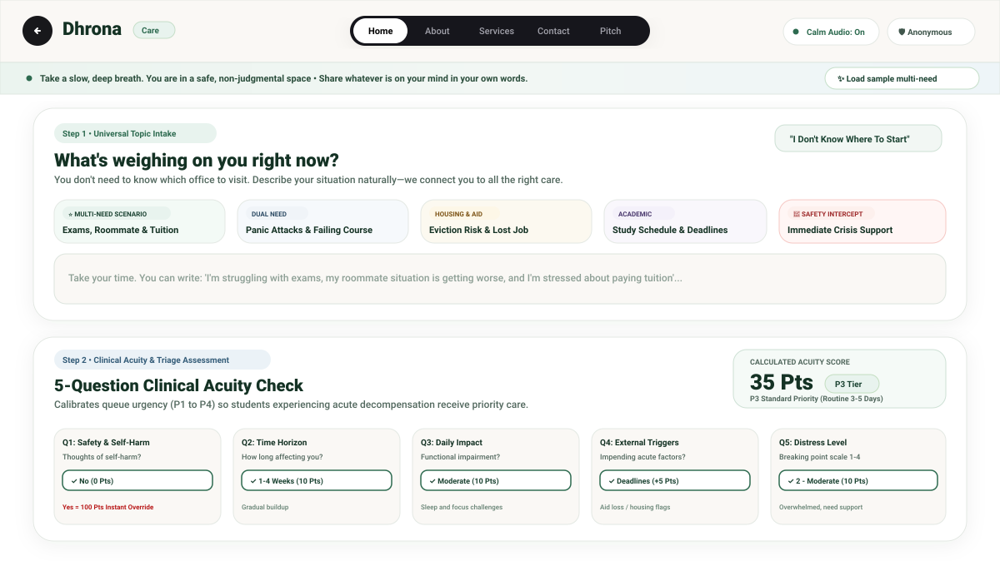
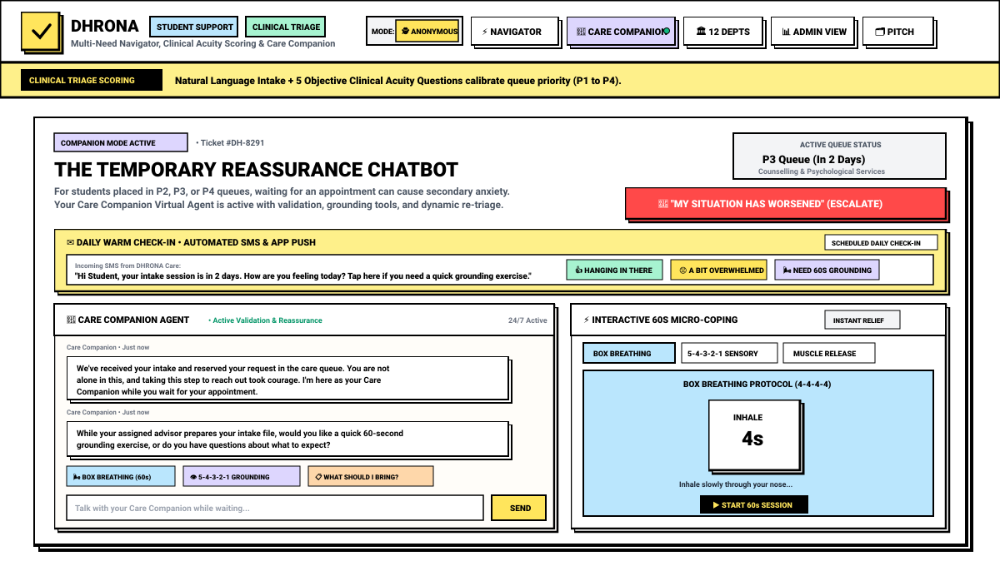
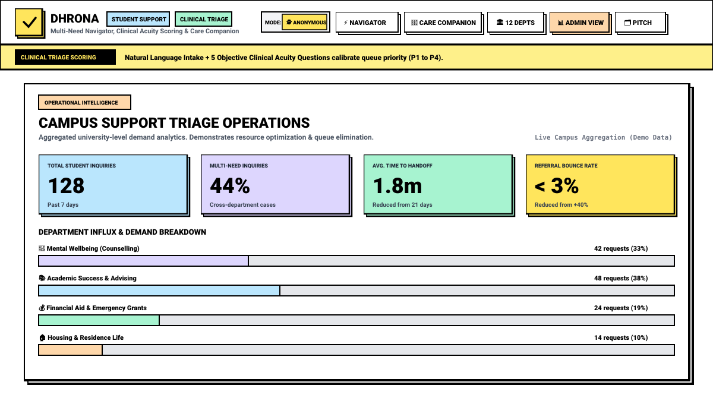

# 🌿 DHRONA — Compassionate Student Support & AI Care Navigator (Track 01)

> **One empathetic front-door to every university department.**  
> *Understand the student → Assess urgency → Detect multiple concurrent needs → One-click handoff → Reassurance companion while waiting.*

---

## 📌 Executive Summary

Traditional universities operate **12+ separate administrative silos** (Counselling, Academic Advising, Financial Aid, Housing, Accessibility, Title IX, Student Health, Career Services, etc.). When students face complex, intertwined challenges (e.g., academic workload paired with sleep disruption, roommate disputes, and tuition anxiety), they are forced to decipher campus organizational charts on their own.

### The Problem in Numbers:
* **12 Fragmented Silos**: Students bounce between disjointed departmental portals.
* **3-Week Average Queue Delay**: Excessive intake wait times cause secondary academic and emotional deterioration.
* **+40% Misdirected Referrals**: Traumatized students must repeat their vulnerable stories 3–4 times to different staff.

**DHRONA eliminates the campus maze.** It replaces bureaucratic silos with a unified, dual-layer intake engine that evaluates unstructured natural language, calculates objective clinical acuity (P1 to P4), builds a multi-department coordinated care plan, generates a consent-based handoff slip, and activates an empathetic **Care Companion Chatbot** during queue wait times.

---

## 🎨 Mental Health Color Psychology & UI/UX Design System

Unlike generic administrative software with harsh jarring colors or hyper-stimulating neon tones, DHRONA is built upon **evidence-based biophilic design principles** proven to reduce nervous system arousal and secondary anxiety:

### 1. The Therapeutic Color Palette
* **Deep Forest & Sage Green (`#1B4332`, `#2D6A4F`, `#E8F3EE`)**:
  * *Psychological Mechanism*: Green wavelengths (520–570 nm) are the most relaxed for human retinal cones, activating parasympathetic vagal pathways that lower blood pressure, reduce muscle tension, and induce emotional safety.
* **Warm Mineral Blue & Mist (`#2C4A63`, `#EBF2F7`, `#CADCE9`)**:
  * *Psychological Mechanism*: Invokes open skies and clear water, promoting cognitive decompression and rational problem-solving during panic episodes.
* **Warm Oat & Linen Canvas (`#FAF8F5`, `#FAF6F0`)**:
  * *Psychological Mechanism*: Replaces stark, blinding pure-white `#FFFFFF` with warm, natural organic parchment tones, minimizing eye strain and hyper-vigilance.
* **Soft Terracotta Coral (`#9E2A2B`, `#FDF0ED`)**:
  * *Psychological Mechanism*: Gently conveys urgency and critical alerts without triggering visceral adrenaline surges or fight-or-flight shock.

### 2. Built-in Somatic Down-Regulation (Web Audio API)
* Integrated **pink noise / soft rain generator** synthesizes ambient soundscapes in real-time in the browser with zero external assets, helping students regulate breathing while completing their intake.

---

## 📸 Product Screenshots & Architecture Views

### 1. Multi-Need Topic Intake & 5-Question Clinical Acuity Scoring

*Figure 1: Step 1 accepts unstructured student natural language with 1-click test scenarios. Step 2 applies the objective 5-question clinical scoring system with real-time queue priority calibration (P1 to P4).*

---

### 2. The Temporary Reassurance Chatbot (Companion Mode)

*Figure 2: Active validation virtual agent for students in waiting queues. Features daily automated SMS check-ins, a prominent "My situation has worsened" dynamic re-triage escalation button, and interactive 60-second micro-coping tools (Circular Breath Mandala, 5-4-3-2-1 Sensory Grounding, Progressive Muscle Relaxation).*

---

### 3. Operational Intelligence & Campus Demand Dashboard

*Figure 3: Aggregated administrative analytics showing total inquiries, multi-need distribution (44%), average time to handoff (1.8m down from 21 days), and real-time department demand breakdown.*

---

## 🛠️ Complete Technical Stack

| Tier | Technologies | Purpose |
| :--- | :--- | :--- |
| **Web Frontend** | `React 19`, `TypeScript`, `Vite` | High-performance, reactive single-page client interface |
| **Typography** | `Plus Jakarta Sans`, `Outfit`, `Fraunces` | Warm humanist typography designed for legibility and emotional calmness |
| **UI Styling** | `Tailwind CSS`, Biophilic Soft-Card Design | Organic rounded-3xl cards, subtle border radiuses, soft ambient shadows |
| **Audio Therapy** | `Web Audio API` (Biquad Filter + Pink Noise) | Real-time browser-synthesized pink noise and rain soundscapes |
| **Component Icons** | `Lucide React` | Semantic SVG icons for departments, emergency services, and tools |
| **Python Application** | `Streamlit 1.32+`, `Python 3.10+` | Full-stack interactive Python demonstration suite |
| **LLM Inference** | `Groq Cloud API` (`llama-3.3-70b-versatile`) | Ultra-fast (&lt; 300ms) structured JSON extraction and multi-need classification |
| **Safety Architecture** | Deterministic Keyword Engine & Clinical Q1 Override | First-layer fail-safe for instant self-harm &amp; crisis diversion (988 Lifeline, Campus Crisis) |
| **Deterministic Fallback** | Heuristic Multi-Need Rules Engine | 100% offline demonstration reliability with zero external API dependencies |
| **State & Storage** | React State Hooks, Local Session History | Zero-telemetry, confidential student privacy preservation |

---

## 🧠 Core System Capabilities

### 1. Smart Multi-Need Detection
Students rarely experience problems in administrative isolation. When a student enters:
> *"I'm struggling with exams, my roommate situation is getting worse every day, and I'm stressed about paying my tuition next month."*

Instead of forcing a single category, DHRONA maps **3 coordinated pathways**:
* 📚 **Academic Success Center**: Workload restructuring, peer tutoring, and exam deferral consultation.
* 🏠 **Student Housing Office**: Neutral roommate dispute mediation and emergency room swaps.
* 💰 **Financial Aid Office**: Student Emergency Relief Fund (SERF micro-grants) and tuition installment plans.

### 2. Objective 5-Question Clinical Acuity Scoring (P1 to P4)
Directly following natural language input, students complete a clinical triage assessment:
1. **Q1: Safety & Self-Harm (Clinical Override)**
   * `No` → 0 Pts
   * `Unsure / Mild thoughts` → 25 Pts
   * `Yes` → **100 Pts (Instant P1 Emergency Override)**
2. **Q2: Time Horizon (Duration & Onset)**: Chronic (5 Pts) to Sudden 48h Collapse (20 Pts)
3. **Q3: Daily Functional Impact**: Minimal (5 Pts) to Total Shutdown (25 Pts)
4. **Q4: Compound Pressures & Triggers**: Deadlines (+5 Pts), Housing/Aid loss (+10 Pts), Trauma (+15 Pts)
5. **Q5: Emotional Distress Level**: Scale 1 (5 Pts) to Scale 4 Breaking Point (20 Pts)

#### Calibrated Priority Tiers:
* **P1 Emergency (Score ≥ 65 or Q1 Yes)**: Immediate crisis protocol / same-day on-call counselor.
* **P2 Urgent (Score 40–64)**: Fast-track 24–48 hour priority slot.
* **P3 Routine (Score 20–39)**: Standard appointment in 3–5 days with Care Companion active.
* **P4 Low Acuity (Score &lt; 20)**: Self-service guidebooks and drop-in peer clinics.

### 3. "Why Am I Being Routed Here?" (Explainable Recommendations)
To build transparent trust, every department recommendation includes exact quoted evidence:
* *"You mentioned in your message: Prolonged sleep disruption, impending tuition deadline, and acute anxiety before lab classes."*
* Formulated strictly as **support guidance**, avoiding medical diagnostic labeling.

### 4. One-Click Consent-Based Support Handoff Slip
Generates a structured handoff document (`DH-XXXXXX`) transmitted securely to assigned duty advisors. Includes granular student consent:
* `[✓] Share structured concern summary & urgency level`
* `[✓] DO NOT share raw conversational transcripts or extraneous private data`
* Toggle between **Anonymous Triage Mode** and **Authenticated Student ID**.

### 5. Temporary Reassurance Chatbot (Companion Mode)
Waiting for an appointment can cause secondary anxiety. When placed in P2, P3, or P4 queues:
* **Active Validation**: *"We've received your intake and reserved your request. You are not alone in this..."*
* **Dynamic Re-Triage**: Prominent **"My situation has worsened"** button to re-run assessment and bump to P1.
* **60-Second Micro-Coping**:
  * 🌬️ **Box Breathing (4-4-4-4)**: Real-time visual geometric breath mandala with expanding/contracting soft emerald pulse.
  * 👁️ **5-4-3-2-1 Sensory Grounding**: Step-by-step physical environment checklist.
  * 🧘 **Progressive Muscle Relaxation (PMR)**: Guided release for shoulders, jaw, and hands.
* **Daily Warm Check-Ins**: Simulated automated SMS/App Push check-in cards.

---

## 📚 Recommended Resources & Design Principles for Mental Health UI

If you want to continue enhancing mental health and healthcare user interfaces, here are the most effective clinical and UX frameworks to explore:

1. **Color & Neuroaesthetics**:
   * *Biophilic Design Patterns (Terrapin Bright Green)*: Visual connections with natural greens, soft lighting, and wood/earth undertones.
   * *Circadian Light & Wavelengths*: Avoiding high-energy blue-violet spikes (&gt;480nm) during evening hours.
2. **Clinical Grounding Methodologies**:
   * *Polyvagal Theory (Dr. Stephen Porges)*: Down-regulating sympathetic fight-or-flight through extended exhalation (such as 4s inhale, 4s hold, 6s exhale).
   * *Progressive Muscle Relaxation (Edmund Jacobson)*: Systematic tensing and releasing of muscle groups to break somatic panic loops.
3. **Frontend Component Ecosystems**:
   * **Radix UI / Tailwind**: Headless, fully accessible ARIA-compliant primitives.
   * **Web Audio API**: Browser-native pink/brown noise generation for focus and calming.
   * **Lucide React**: Clean, non-threatening line iconography.

---

## 🏛️ The 12 University Silos Mapped

| # | Department Name | Core Domain | Baseline Wait | Friction Level |
| :-: | :--- | :--- | :-: | :-: |
| 1 | **Counselling & Psychological Services** | Mental Wellbeing | 18 days | High |
| 2 | **Academic Advising & Success Center** | Coursework & Exams | 14 days | Medium |
| 3 | **Student Financial Aid & Scholarships** | Emergency Grants & Tuition | 21 days | High |
| 4 | **Residence Life & Housing Operations** | Dorms & Roommate Mediation | 12 days | High |
| 5 | **Disability Resource Center (DRC)** | Accommodations & Assistive Tech | 16 days | Medium |
| 6 | **Title IX & Student Safety Advocacy** | Harassment & Confidential Care | Immediate | Critical |
| 7 | **One-Stop Student Support Desk** | Administrative Navigation | 3 days | High |
| 8 | **International Student Services (ISSO)** | Visas & Cultural Transition | 15 days | Medium |
| 9 | **University Career & Internship Center** | Career Coaching & Placements | 10 days | Low |
| 10 | **Student Health & Immunization Clinic** | Physical Medicine & Prescriptions | 7 days | Medium |
| 11 | **Veteran & Military Affairs Office** | GI Bill & Veteran Transition | 5 days | Low |
| 12 | **Office of the Dean of Students** | Emergency Appeals & Grievances | 14 days | High |

---

## 🚀 Quick Start Guide

### Option A: Run the React 19 Web App (Recommended)

```bash
# 1. Clone the repository
git clone https://github.com/PiyushBorban49/serviceNow-event.git
cd serviceNow-event

# 2. Install node dependencies
npm install

# 3. Start local development server (Port 3000)
npm run dev

# 4. Build production bundle
npm run build
```

### Option B: Run the Python & Streamlit Application

```bash
# 1. Create and activate a Python virtual environment
python3 -m venv venv
source venv/bin/activate    # On Windows: venv\Scripts\activate

# 2. Install dependencies
pip install -r requirements.txt

# 3. (Optional) Set your Groq API key for live LLM inference
echo "GROQ_API_KEY=gsk_your_key_here" >> .env

# 4. Launch the Streamlit application
streamlit run app.py
```

---

## 🔒 Confidentiality & Medical Safety Disclaimer
DHRONA is an administrative triage navigation and support prioritization engine. It is **not** a clinical diagnostic instrument, psychiatric intervention tool, or substitute for emergency healthcare. Any detected crisis keywords immediately trigger deterministic protocols routing students directly to the **988 Suicide & Crisis Lifeline** and on-campus emergency dispatch.
